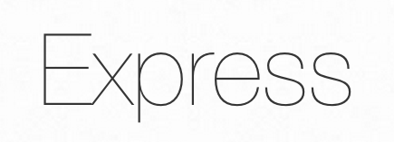

<h1 align="center">Hi👋, I'm Ruhul Amin</h1>
<h3 align="center">A passionate frontend developer from Bangladesh</h3>

  

- 🔭 I’m currently working on **STS Consultancy Services** as a front end developer.

- 🌱 I’m currently learning **React, Node, MongoDB**.

- 👨‍💻 All of my projects are available at [Github](https://github.com/devruhul?tab=repositories)

- 📫 How to reach me **ruhulamin262001@gmail.com**.

- ⚡ Fun fact **I love to eat and cook noodles**.

<h3 align="left">Connect with me:</h3>

<h3 align="left">Languages and Tools:</h3>

     
     
       

&nbsp;

